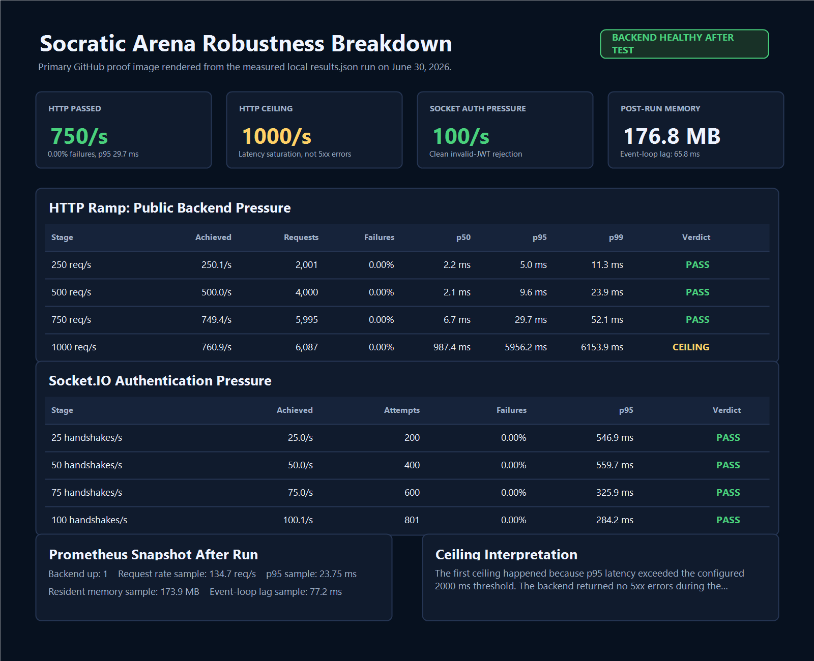
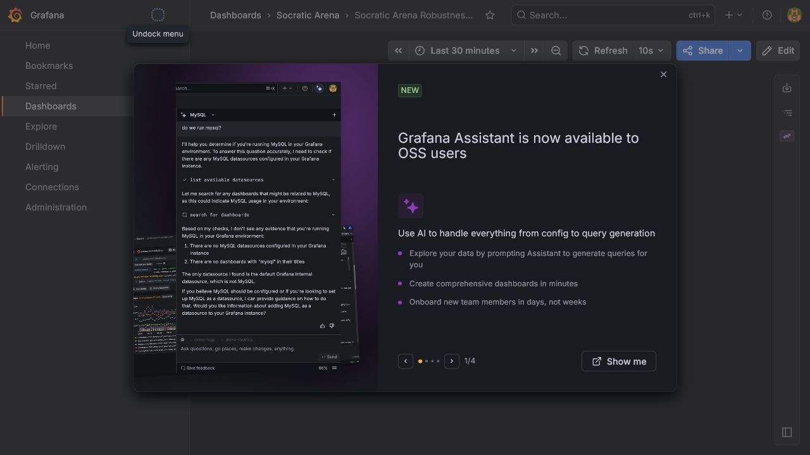
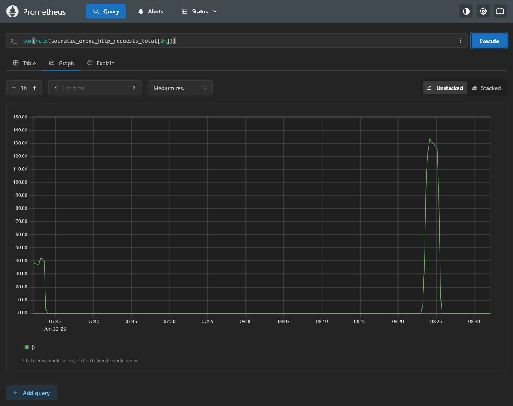
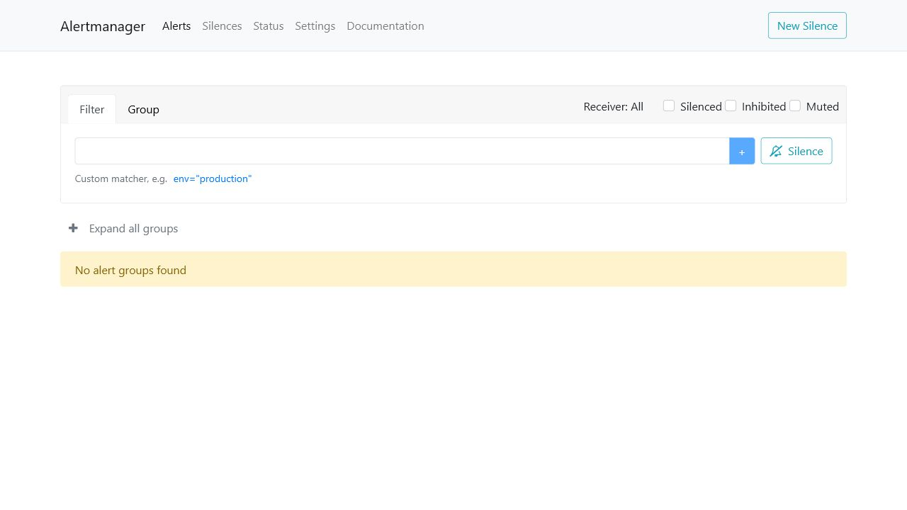

# Socratic Arena Robustness Evidence

This folder contains controlled local breakdown testing for the Socratic Arena backend and realtime layer.

Latest verified run:

- Report: [runs/2026-06-30-local-breakdown-after-metrics-cache/SUMMARY.md](runs/2026-06-30-local-breakdown-after-metrics-cache/SUMMARY.md)
- Raw results: [runs/2026-06-30-local-breakdown-after-metrics-cache/results.json](runs/2026-06-30-local-breakdown-after-metrics-cache/results.json)

## Executive Result

The June 30, 2026 local breakdown run used Prometheus, Grafana, Alertmanager, and the custom local runner in [tools/robustness/breakdown-runner.mjs](../../tools/robustness/breakdown-runner.mjs).

| Area | Result |
|---|---|
| Backend health after test | Healthy |
| HTTP public endpoint pressure | Passed through 750 target req/s |
| First HTTP ceiling | 1000 target req/s, caused by latency saturation, not 5xx errors |
| Socket.IO auth pressure | Passed through 100 handshakes/s |
| Socket rejection behavior | Invalid JWTs were rejected cleanly with 0 runner-level failures |
| Resident memory after run | 176.8 MB |
| Event-loop lag after run | 65.8 ms |

The key hardening added before the final run was a short metrics cache around `GET /metrics`. That stopped repeated Prometheus-format metric generation from becoming the bottleneck during heavy scraping/load-test traffic.

## Screenshot Evidence

Primary benchmark evidence:



Grafana dashboard:



Prometheus request-rate query:



Alertmanager baseline:



## Reproduce The Breakdown Run

Start the backend:

```powershell
cd backend
$env:ALERT_WEBHOOK_SECRET="local-alert-secret"
npm run dev
```

Start observability:

```powershell
docker compose -f observability/docker-compose.yml up -d --pull never
```

Run the controlled local breakdown test:

```powershell
node tools/robustness/breakdown-runner.mjs `
  --stages 250,500,750,1000,1500 `
  --socket-stages 25,50,75,100 `
  --duration 8 `
  --concurrency 2048 `
  --out-dir docs/robustness/runs/manual-local-breakdown
```

The runner stops each ramp once p95 latency exceeds the configured ceiling or the failure rate exceeds the configured threshold. By default it refuses non-local targets, so it will not accidentally load-test production infrastructure.

## What The Runner Covers

- Public HTTP pressure over `GET /health`, `GET /metrics`, unknown routes, and JSON 404s.
- Socket.IO authentication pressure using intentionally invalid JWTs.
- Backend health before and after the run.
- Prometheus query snapshots for backend up status, request rate, p95 latency, memory, and event-loop lag.
- Machine-readable `results.json` plus a GitHub-friendly `SUMMARY.md`.

## Automatic Alert Coverage

Prometheus evaluates rules for:

- backend down or restarted
- high HTTP p95 latency
- HTTP 5xx error rate above 5%
- Node.js event-loop lag
- high resident memory
- Gemini AI failures
- Socket.IO disconnect storms
- matchmaking queue backlog

Alertmanager sends alerts to both the backend webhook and the independent alert-relay container. The relay can forward to Discord, Slack, or any compatible webhook through `ALERT_WEBHOOK_URL`, so backend-down alerts can still leave the local observability stack even when the app process is unhealthy.

## Known Limits

This is a local, single-machine robustness ceiling. It is useful proof that the backend handles controlled pressure and that observability works, but it is not a replacement for provider-approved staging tests against Vercel, Render, and Supabase.

Authenticated full-match load is intentionally not included yet. That requires seeded test accounts and valid Supabase JWTs so the test can exercise real debates without polluting production users or data.
